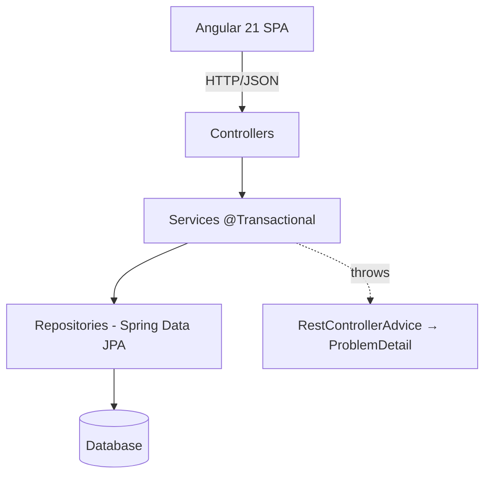
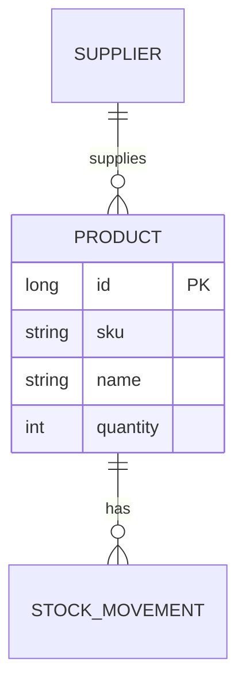
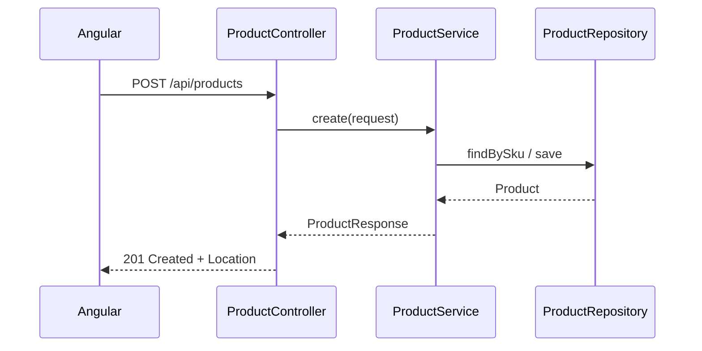

# Backend technical documentation

Produce `docs/backend.md` (Markdown + Mermaid), then export to
`docs/backend.pdf`. The PDF toolchain here is the **canonical pipeline** also
reused by `frontend-documentation`.

## What to document (structure)

Derive every section from the actual code — read the controllers, services,
repositories, and entities first; never document an idealized design.

1. **Overview** — purpose, stack (Java 25, Spring Boot 4), how to run.
2. **Architecture** — the layered design (controller → service → repository →
   DB) as a diagram.
3. **Domain / data model** — entities and relationships as an ER diagram.
4. **API reference** — endpoints table (method, path, request, response,
   status codes, errors). Cross-link to OpenAPI/Swagger if present.
5. **Key flows** — sequence diagram of a representative request end to end.
6. **Cross-cutting** — error handling (ProblemDetail), validation, security,
   transactions, configuration/profiles.
7. **Build & test** — `./mvnw` commands, test strategy (link `spring-boot-testing`).

## Mermaid diagrams to include

Use fenced ` ```mermaid ` blocks so they render in GitHub/IDE preview *and* in
the PDF. Generate them from the real code.

**Layered architecture**



**Entity-relationship (data model)**



**Request sequence (controller → service → repository)**



Add a **class diagram** for the domain model when entities have real behavior,
and a **flowchart** for any non-trivial business rule (e.g. reorder logic).

## Export to PDF

Toolchain (Node, no LaTeX): `@mermaid-js/mermaid-cli` renders the Mermaid blocks
to images and rewrites the Markdown; `md-to-pdf` (Puppeteer) produces the PDF.

```bash
npm install -D @mermaid-js/mermaid-cli md-to-pdf
```

Two-step build (keep the source `.md` with live Mermaid blocks; build into a
`build/` dir):

```bash
# 1. render Mermaid blocks → images, emit a processed Markdown file
npx mmdc -i docs/backend.md -o build/backend.md

# 2. processed Markdown → PDF
npx md-to-pdf build/backend.md && mv build/backend.pdf docs/backend.pdf
```

Wire it as a script in `package.json` so it's one command and repeatable:

```json
{
  "scripts": {
    "docs:backend": "mmdc -i docs/backend.md -o build/backend.md && md-to-pdf build/backend.md && mv build/backend.pdf docs/backend.pdf"
  }
}
```

Run `npm run docs:backend`, then confirm `docs/backend.pdf` exists and the
diagrams rendered (open it / check it's non-empty). Report the real result.

> Alternative pipeline: `pandoc docs/backend.md -o docs/backend.pdf -F mermaid-filter`
> (needs Pandoc + a PDF engine). Prefer the Node pipeline above to stay within
> the repo's toolchain.

## Principles

- **Generated from truth**: read the code; if the doc and code disagree, fix the
  doc (or flag the code). Regenerate after backend changes.
- Keep diagrams small and focused — one concept each. Several clear diagrams beat
  one giant one.
- Don't hand-draw ASCII for things Mermaid expresses; don't paste screenshots of
  diagrams (keep them as text so they diff and re-render).
- Commit `docs/backend.md`; the PDF is a build artifact (consider gitignoring
  `build/` and, optionally, the PDF).
