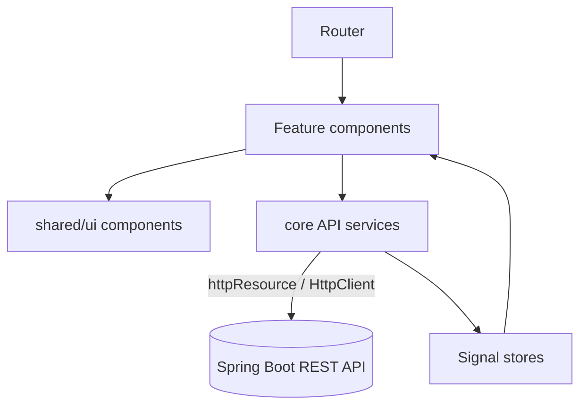
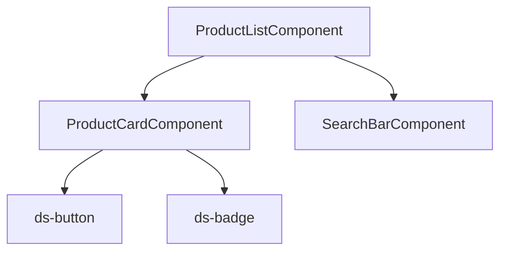
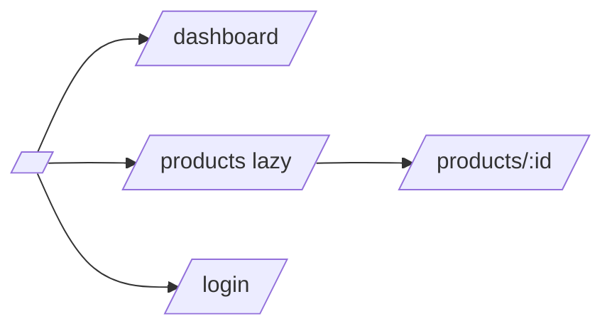
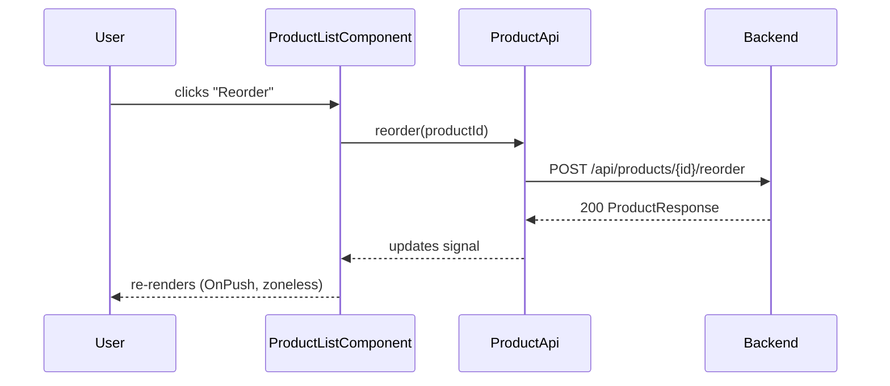

# Frontend technical documentation

Produce `docs/frontend.md` (Markdown + Mermaid), then export to
`docs/frontend.pdf`. The **PDF export toolchain and principles are identical to
`backend-documentation`** — reuse that pipeline; only the content/diagrams below
are frontend-specific.

## What to document (structure)

Read the real app first (`app.config.ts`, `app.routes.ts`, feature folders,
services) and document what exists.

1. **Overview** — purpose, stack (Angular 21, standalone, signals, zoneless,
   Tailwind), how to run (`npm start`).
2. **Architecture** — `core` / `shared` / `features` layering as a diagram.
3. **Routing** — route map and lazy-loaded features.
4. **Components** — feature/component tree for the main screens; inputs/outputs
   of key shared components.
5. **State & data flow** — how signals/`httpResource`/services move data from
   the API to the view.
6. **Design system** — link `angular-design-system` and `tailwindcss` (tokens,
   theming, shared UI).
7. **Build & test** — `npm` scripts, Vitest strategy (link `angular-testing`).

## Mermaid diagrams to include

Fenced ` ```mermaid ` blocks (render in preview *and* PDF). Generate from the
real component/route structure.

**Application architecture (layers)**



**Component tree (a feature)**



**Routing**



**User action → HTTP → render (sequence)**



Add a **state diagram** if a screen has meaningful UI states
(loading / loaded / empty / error from an `httpResource`).

## Export to PDF

Same Node pipeline as `backend-documentation` (`@mermaid-js/mermaid-cli` +
`md-to-pdf`). Add a parallel script:

```json
{
  "scripts": {
    "docs:frontend": "mmdc -i docs/frontend.md -o build/frontend.md && md-to-pdf build/frontend.md && mv build/frontend.pdf docs/frontend.pdf"
  }
}
```

Run `npm run docs:frontend`, then confirm `docs/frontend.pdf` exists and the
diagrams rendered. Report the real result.

## Principles

- Same as `backend-documentation`: generated from truth, small focused diagrams,
  keep diagrams as text (Mermaid), commit the `.md`, treat the PDF as a build
  artifact, regenerate after frontend changes.
- Document the *contract* with the backend (which endpoints each service calls)
  so the two docs stay consistent — cross-reference `backend-documentation`.
