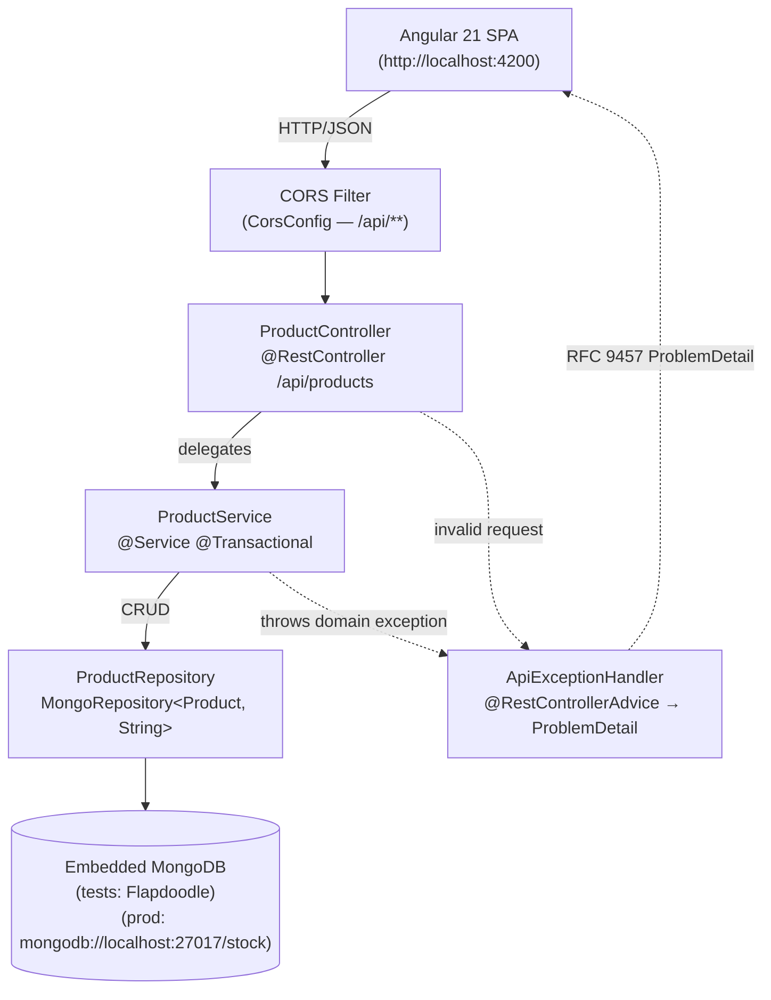
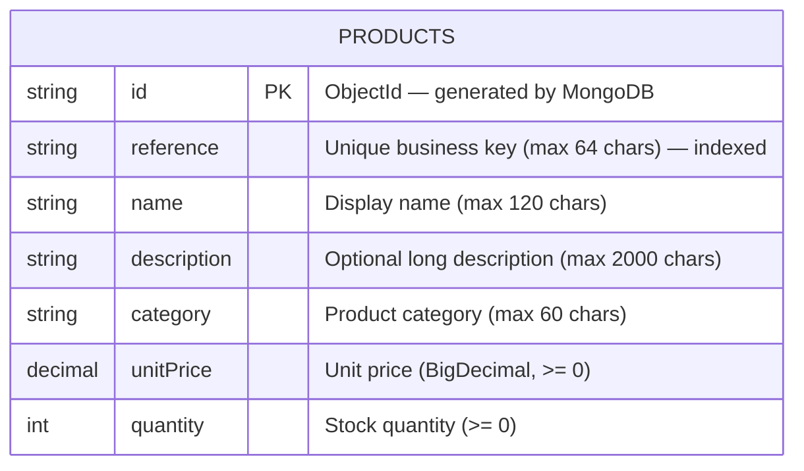
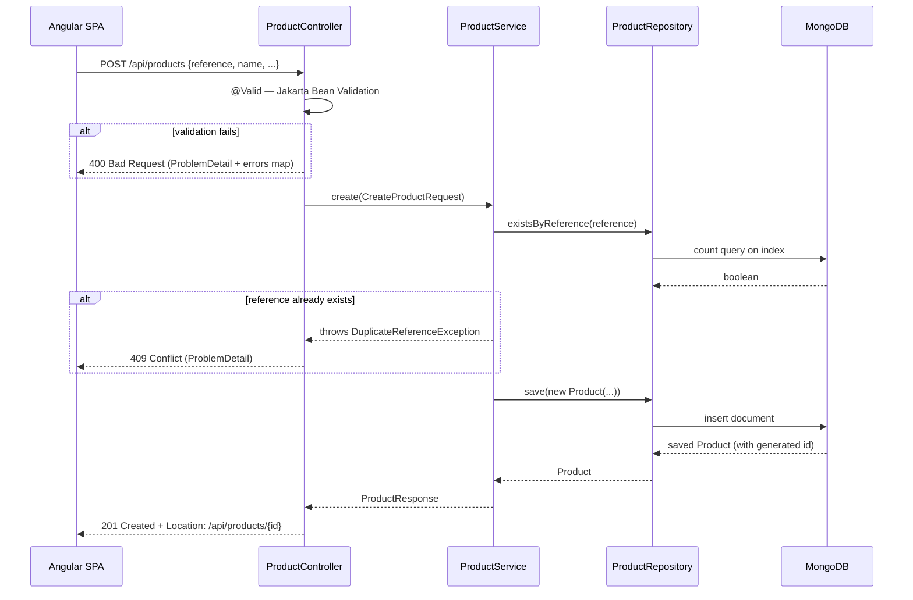
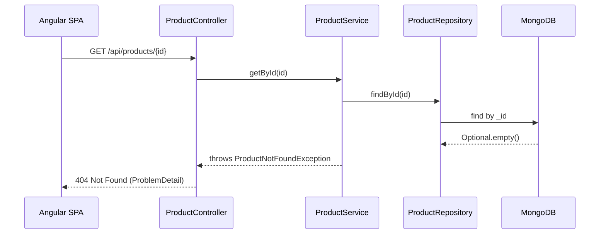
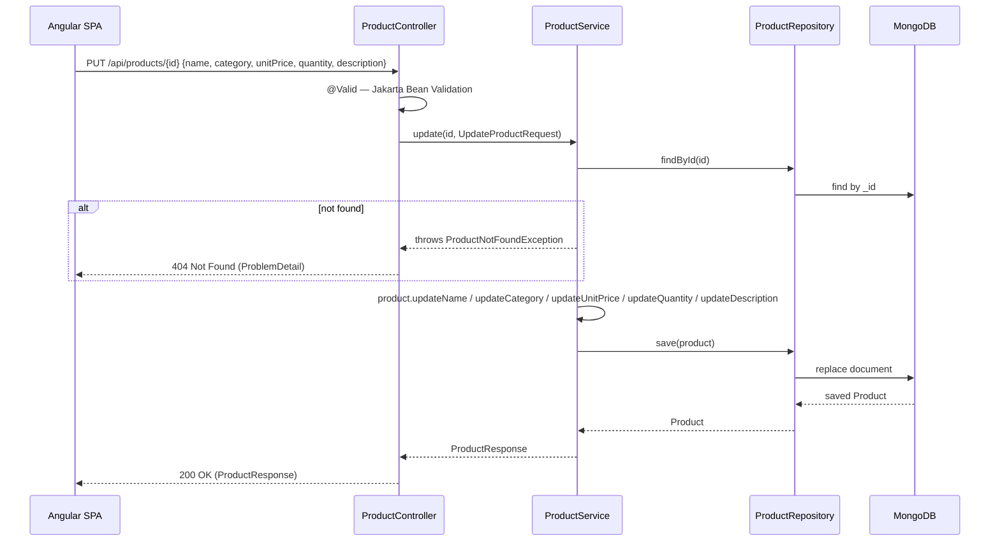

# Stock App — Backend Technical Documentation

## 1. Overview

**Purpose:** REST API for a stock management application, serving an Angular 21
SPA. Manages a catalogue of products with full CRUD support.

**Stack:**
| Component | Version |
|---|---|
| Java | 25 (virtual threads enabled) |
| Spring Boot | 4.0.6 |
| Spring Framework | 7 |
| Spring Data MongoDB | via Spring Boot 4 |
| Embedded MongoDB (tests) | Flapdoodle 4.33.0 |
| Bean Validation | Jakarta Validation 3.x |
| Null-safety | JSpecify 1.0.0 |

**Run locally:**

```bash
cd backend
./mvnw spring-boot:run
# API available at http://localhost:8080/api/products
```

The application auto-creates the `products` collection index on startup
(`spring.data.mongodb.auto-index-creation: true`). A `ProductSeeder`
pre-populates 5 sample products when the collection is empty (disabled on the
`test` profile).

---

## 2. Layered Architecture

The backend follows a strict three-layer architecture. Each layer has a single
responsibility and communicates only with its immediate neighbour.



**Rules enforced:**
- Controllers are thin: no business logic, no direct repository access.
- Services own all business rules and are the only `@Transactional` boundary.
- Repositories are pure persistence: no logic beyond derived-query methods.
- Entities are never exposed over the REST boundary; record DTOs cross the wire.

---

## 3. Domain / Data Model

### MongoDB Document

The `Product` class is a MongoDB document stored in the `products` collection.



**Key constraints:**
- `reference` has a unique index (`@Indexed(unique = true)`). Duplicate
  references are rejected at the service layer before hitting MongoDB, returning
  HTTP 409.
- `description` is optional (`@Nullable`).
- `id` is a MongoDB-generated `ObjectId` string; it is `@Nullable` before
  first save.
- `reference` is **immutable** after creation (update requests do not include it).

### DTO Shapes

The three record DTOs that cross the REST boundary:

**`CreateProductRequest`** (POST body)
```json
{
  "reference":   "SKU-001",
  "name":        "Café Arabica 1kg",
  "description": "Café en grains 100% Arabica",
  "category":    "beverages",
  "unitPrice":   12.90,
  "quantity":    50
}
```

**`UpdateProductRequest`** (PUT body — `reference` is absent, immutable)
```json
{
  "name":        "Café Arabica 1kg — premium",
  "description": null,
  "category":    "beverages",
  "unitPrice":   14.50,
  "quantity":    45
}
```

**`ProductResponse`** (all GET / POST / PUT responses)
```json
{
  "id":          "683f2a1c4d9e0b1234567890",
  "reference":   "SKU-001",
  "name":        "Café Arabica 1kg",
  "description": "Café en grains 100% Arabica",
  "category":    "beverages",
  "unitPrice":   12.90,
  "quantity":    50
}
```

---

## 4. API Reference

Base path: `/api/products`

| Method | Path | Request body | Success | Error codes |
|--------|------|--------------|---------|-------------|
| `GET` | `/api/products` | — | `200 OK` — `ProductResponse[]` | — |
| `GET` | `/api/products/{id}` | — | `200 OK` — `ProductResponse` | `404` — product not found |
| `POST` | `/api/products` | `CreateProductRequest` | `201 Created` + `Location` header — `ProductResponse` | `400` — validation failure; `409` — duplicate reference |
| `PUT` | `/api/products/{id}` | `UpdateProductRequest` | `200 OK` — `ProductResponse` | `400` — validation failure; `404` — product not found |

**ProblemDetail error shape (RFC 9457):**

All errors are serialised as `application/problem+json` by `ApiExceptionHandler`.

```json
{
  "type":     "about:blank",
  "title":    "Not Found",
  "status":   404,
  "detail":   "Product not found: 683f2a1c4d9e0b1234567890"
}
```

Validation errors (400) additionally carry an `errors` map:

```json
{
  "type":   "about:blank",
  "title":  "Bad Request",
  "status": 400,
  "detail": "Validation failed",
  "errors": {
    "reference": "must not be blank",
    "unitPrice": "must be greater than or equal to 0"
  }
}
```

---

## 5. Key Request Flows

### POST /api/products — happy path and duplicate rejection



### GET /api/products/{id} — not found path



### PUT /api/products/{id} — update flow



---

## 6. Cross-cutting Concerns

### Error Handling

`ApiExceptionHandler` (`@RestControllerAdvice`) is the single place where
exceptions are translated to HTTP responses. No endpoint handles errors
individually. Three mappings:

| Exception | HTTP status | When thrown |
|---|---|---|
| `ProductNotFoundException` | 404 Not Found | `getById` or `update` with unknown id |
| `DuplicateReferenceException` | 409 Conflict | `create` with an already-used reference |
| `MethodArgumentNotValidException` | 400 Bad Request | Jakarta Validation fails on `@Valid` |

Stack traces are never sent to the client.

### Validation

Jakarta Bean Validation annotations on the request records:
- `@NotBlank` + `@Size` on string fields (reference max 64, name max 120,
  category max 60, description max 2000).
- `@NotNull` + `@PositiveOrZero` on `unitPrice` (`BigDecimal`).
- `@PositiveOrZero` on `quantity` (`int`).

Controllers declare `@Valid` on `@RequestBody`; no manual `if` validation in
any layer.

### CORS

`CorsConfig` permits the Angular SPA at `http://localhost:4200` to call
`/api/**` with GET, POST, PUT, DELETE, OPTIONS and any headers.

### Null-safety

All source files are annotated with JSpecify. `@NullMarked` is declared in
`package-info.java` files; fields that may be `null` carry `@Nullable`
(`Product.id`, `Product.description`).

### Virtual Threads

`spring.threads.virtual.enabled: true` — Spring Boot 4 runs request handling on
Java 25 virtual threads (Project Loom), maximising throughput without increasing
complexity.

### Configuration Profiles

| Profile | Effect |
|---|---|
| _(default)_ | Connects to `mongodb://localhost:27017/stock`; seeds 5 sample products on first run |
| `dev` | Additional dev-time overrides (`application-dev.yml`) |
| `test` | `ProductSeeder` is disabled (`@Profile("!test")`); Flapdoodle embedded MongoDB is used |

---

## 7. Build & Test

### Commands

```bash
# from backend/
./mvnw test                          # run full test suite
./mvnw test -Dtest=ProductServiceTest  # run one class
./mvnw spring-boot:run               # start the API on :8080
./mvnw package                       # build the fat JAR
```

### Test Strategy

30 tests across four classes, all green as of the last quality gate run:

| Test class | Slice | What it covers |
|---|---|---|
| `ProductRepositoryTest` | `@DataMongoTest` + Flapdoodle | `existsByReference`, `findByReference`, unique-index enforcement |
| `ProductServiceTest` | Plain JUnit 5 + Mockito | `create` happy path, duplicate rejection, `getById` not-found, `update` |
| `ProductControllerTest` | `@WebMvcTest` | JSON serialisation, `@Valid` rejection (400), 404/409 mapping |
| `ProductApiIT` | `@SpringBootTest` + Flapdoodle | End-to-end: CRUD sequence over real HTTP, duplicate 409, not-found 404 |

See `.claude/skills/spring-boot-testing` for the canonical test patterns used
in this repo.

### Generate PDF documentation

The `.md` file is the primary deliverable and renders with live Mermaid diagrams
in any Markdown preview (GitHub, VS Code, IntelliJ). To export a PDF, install
the Node toolchain once in the repo root and run:

```bash
npm install -D @mermaid-js/mermaid-cli md-to-pdf
npm run docs:backend
```

This requires a `docs:backend` script in the root `package.json`:

```json
{
  "scripts": {
    "docs:backend": "mmdc -i docs/backend.md -o build/backend.md && md-to-pdf build/backend.md && mv build/backend.pdf docs/backend.pdf"
  }
}
```
