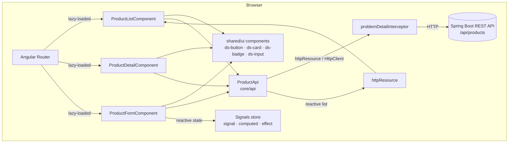
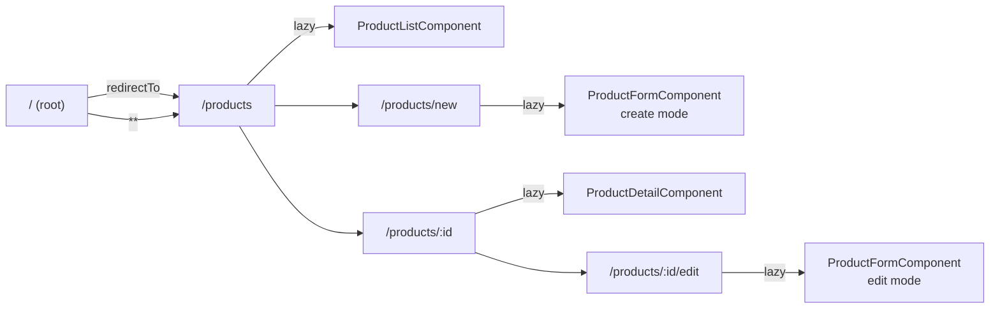
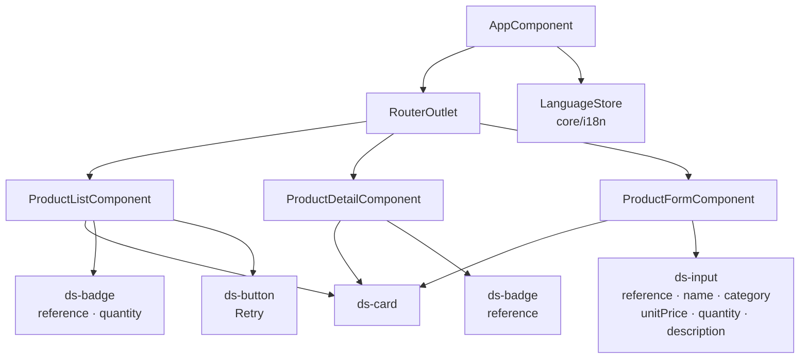
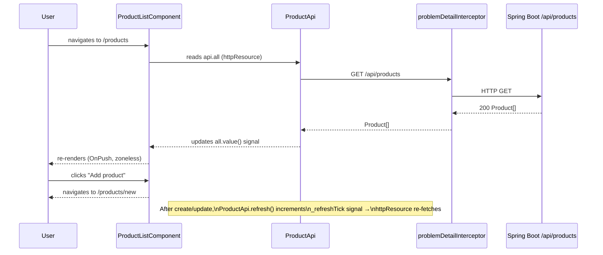
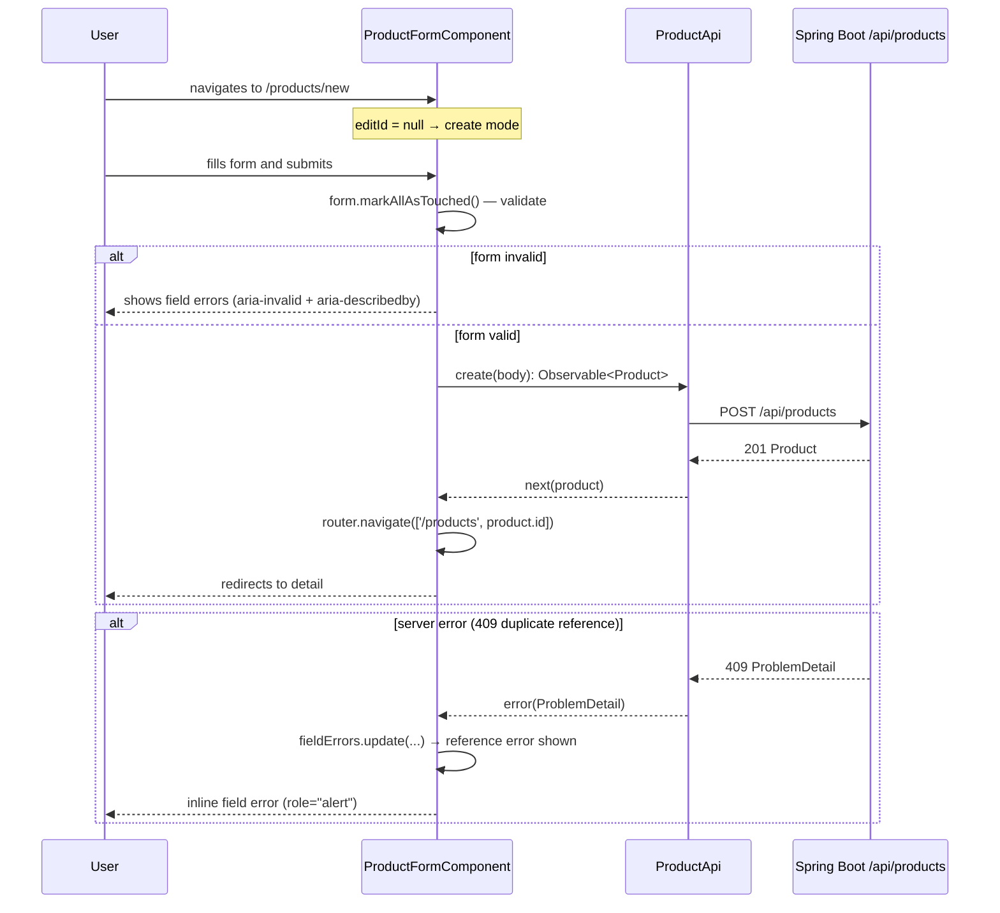
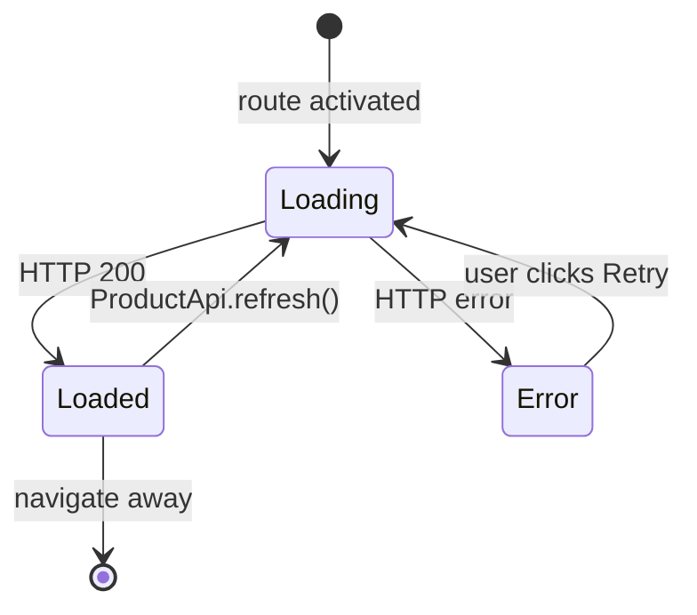

# Frontend Technical Documentation

Stock Manager — Angular 21 frontend.
Generated from the actual source code in `frontend/src/`.

---

## 1. Overview

**Purpose**: A product inventory management UI — list, view, create, and edit
stock items. It talks to a Spring Boot 4 REST backend via a reverse-proxy at `/api`.

**Stack**

| Concern | Technology |
|---------|-----------|
| Framework | Angular 21 (standalone, zoneless) |
| Change detection | `provideZonelessChangeDetection()` — no zone.js |
| Reactivity | Signals (`signal`, `computed`, `effect`), `httpResource` |
| Styling | Tailwind CSS v4 (CSS-first `@theme`) + CSS custom properties |
| i18n | Transloco — runtime EN / FR switching |
| Testing | Vitest 4 — component tests with TestBed, no Karma |
| Build | Angular CLI 21 (`ng build`) |

**Running locally**

```bash
cd frontend
npm ci
npm start          # dev server on http://localhost:4200
npm run build      # production bundle → dist/frontend/
npm test           # Vitest in watch mode
npm run test:run   # Vitest single-run (CI)
npm run lint       # ESLint
```

The dev server proxies `/api/**` to `http://localhost:8080` via `proxy.conf.json`.

---

## 2. Architecture



**Layer responsibilities**

| Layer | Path | Responsibility |
|-------|------|---------------|
| `core/api` | `product-api.ts` | All HTTP calls, `httpResource` reactive list |
| `core/models` | `product.model.ts` | TypeScript interfaces mirroring backend DTOs |
| `core/i18n` | `language.store.ts`, `transloco.config.ts` | Runtime language switching |
| `core/interceptors` | `problem-detail.interceptor.ts` | Maps HTTP errors to `ProblemDetail` |
| `shared/ui` | `button`, `card`, `badge`, `input` | Design system components |
| `features/products` | `product-list`, `product-detail`, `product-form` | Feature screens |

---

## 3. Routing



All feature routes are lazy-loaded via `loadComponent`. The router redirects
unknown paths to `/products`.

---

## 4. Component tree



### Shared UI components — key inputs / outputs

| Component | Selector | Key inputs | Notes |
|-----------|----------|-----------|-------|
| `ButtonComponent` | `ds-button` | `variant`, `size`, `type`, `disabled`, `loading` | Renders native `<button>` |
| `CardComponent` | `ds-card` | `dataTest` | Surface container |
| `BadgeComponent` | `ds-badge` | `variant` (`success\|warning\|danger\|info\|default`) | Color-coded pill |
| `InputComponent` | `ds-input` | `inputId`, `label`, `required`, `error` | Wraps any `<input>` or `<textarea>` with label and error |

Navigation link-buttons (back, cancel, add, view-detail, edit) are rendered as
`<a routerLink>` elements styled with the global `.ds-btn` classes, keeping
semantic HTML (one interactive element per control).

---

## 5. State and data flow

### httpResource — reactive product list



### Signal-driven form (create / edit)



### httpResource states



---

## 6. Design system

Tokens are defined in `src/styles.css` under `@theme` (Tailwind v4 CSS-first
config — no `tailwind.config.js`). See `angular-design-system` and `tailwindcss`
skills for full detail.

**Color tokens** (extract)

| Token | Value | Usage |
|-------|-------|-------|
| `--color-primary-500` | `#2563eb` | Primary actions, focus rings |
| `--color-danger-500` | `#dc2626` | Errors, danger badges |
| `--color-success-500` | `#16a34a` | Success badges |
| `--color-warning-700` | `#92400e` | Warning badge text (AA contrast on warning-50) |
| `--color-text` | `#0f172a` | Body copy |
| `--color-text-muted` | `#64748b` | Secondary text |
| `--color-surface` | `#ffffff` | Card backgrounds |

**Accessibility tokens**

```css
:focus-visible { outline: 2px solid var(--color-primary-500); outline-offset: 2px; }
@media (prefers-reduced-motion: reduce) { *, ::before, ::after { animation: none !important; transition: none !important; } }
```

**Global utility classes**: `.ds-btn`, `.ds-btn--primary`, `.ds-btn--secondary`,
`.ds-btn--sm`, `.ds-btn--danger`, `.sr-only` (visually hidden but accessible).

---

## 7. Accessibility (WCAG 2.2 AA)

Key measures applied:

- **Skip link**: `<a class="skip-link" href="#main">` with translatable text
  (`app.skipToMain`) — first element in DOM, visible on focus.
- **Semantic HTML**: `<main id="main">`, `<header role="banner">`, `<nav>`,
  `<table>` with `<th scope="col">`, `<dl>/<dt>/<dd>` for detail fields,
  `<label for>` on all form inputs.
- **No interactive-inside-interactive**: navigation buttons are `<a routerLink>`
  styled with `.ds-btn` global classes, never `<a>` wrapping `<button>`.
- **Keyboard operability**: all controls reachable by Tab; `:focus-visible` ring
  on all interactive elements; `tabindex="-1"` headings focused programmatically
  on route change via `afterNextRender` / `viewChild`.
- **Live regions**: `role="status" aria-live="polite"` for loading states;
  `role="alert"` for errors and server-side form errors; `aria-live="polite"`
  for save-in-progress.
- **Form a11y**: `aria-invalid`, `aria-describedby` pointing to error `<p>` IDs
  generated by `ds-input` (`${inputId}-error`); `aria-label` on the form element.
- **Color contrast**: all badge text passes WCAG AA (warning uses `#92400e` on
  `#fffbeb` = 7.2:1).
- **Touch targets**: minimum 44×44 px on all interactive controls (lang buttons,
  primary/secondary buttons).
- **`aria-current="page"`** on active nav link.
- **Responsive**: mobile-first layout with Tailwind breakpoint prefixes;
  `overflow-x: auto` on the table; header and content area reflow at 320px.

---

## 8. Backend API contract

`ProductApi` (`core/api/product-api.ts`) calls these endpoints:

| Method | Path | Purpose | Component |
|--------|------|---------|-----------|
| `GET` | `/api/products` | List all products | `ProductListComponent` (via `httpResource`) |
| `GET` | `/api/products/:id` | Get single product | `ProductDetailComponent`, `ProductFormComponent` (edit) |
| `POST` | `/api/products` | Create product | `ProductFormComponent` (create) |
| `PUT` | `/api/products/:id` | Update product | `ProductFormComponent` (edit) |

Errors are mapped to `ProblemDetail` (RFC 9457) by `problemDetailInterceptor`.
Cross-reference `docs/backend.md` for the backend contract.

---

## 9. Build and test

| Script | Command | Description |
|--------|---------|-------------|
| `start` | `ng serve` | Dev server with hot reload |
| `build` | `ng build` | Production bundle → `dist/frontend/` |
| `test` | `ng test` | Vitest watch mode |
| `test:run` | `ng test --no-watch` | Single-run (CI) |
| `lint` | `ng lint` | ESLint with Angular ruleset |
| `docs:frontend` | see below | Generate and export this document as PDF |

**Test strategy** (see `angular-testing` skill):

- TestBed component tests with `provideZonelessChangeDetection()`
- `await fixture.whenStable()` for async (no `fakeAsync`/`tick`)
- Mock services via `TestBed.overrideProvider`
- Assertions via `data-test` attribute selectors
- Transloco tested with `TranslocoTestingModule.forRoot`

**Generating the PDF**

```bash
npm run docs:frontend
# Equivalent to:
# mmdc -i docs/frontend.md -o build/frontend.md   (renders Mermaid)
# md-to-pdf build/frontend.md                       (converts to PDF)
# mv build/frontend.pdf docs/frontend.pdf
```

Requires `@mermaid-js/mermaid-cli` and `md-to-pdf` as dev dependencies.
Commit `docs/frontend.md`; treat `docs/frontend.pdf` as a build artifact.
